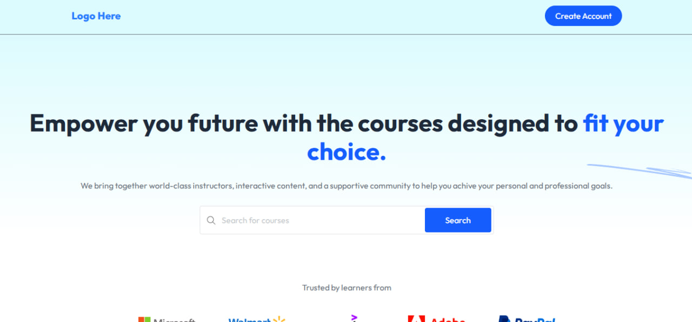
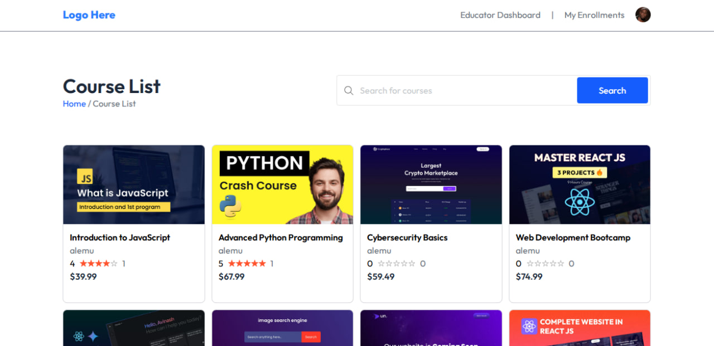
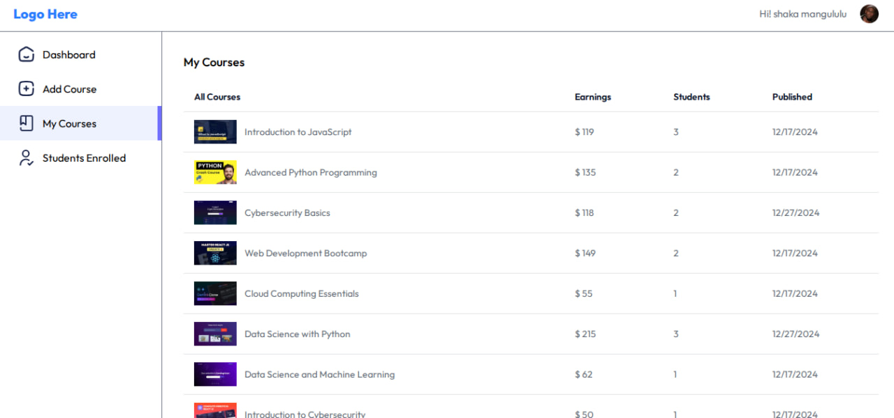
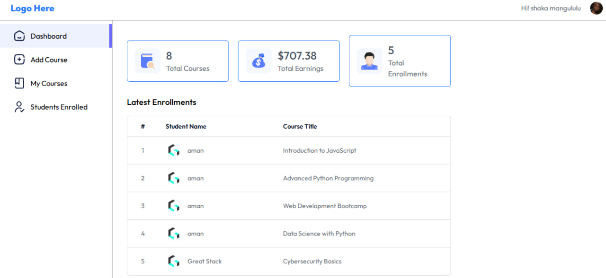

#  Learning Management System (LMS)

> 🚧 This project is currently in active development.

FreeCourses is a modern Learning Management System (LMS) web application that allows educators to publish courses and students to enroll and study online.

---

## 📸 Preview

### Preview 1: Home page_1
 <!-- Update path if necessary -->

---
### Preview 2: Home page_2
 <!-- Update path if necessary -->

---
### Preview 3: Courses list page
 <!-- Update path if necessary -->

---
### Preview 4: My courses page
 <!-- Update path if necessary -->

---
### Preview 5: Educators dashboard
 <!-- Update path if necessary -->

---

## 🚀 Features until now

-  Instructor dashboard for viewing 
-  Student portal for browsing and enrolling in courses
-  Responsive design (mobile + desktop)
-  Built with React + Vite
-  User context with centralized state management
-  User Authentication with [Clerk](https://clerk.dev) — featuring built-in Sign-in, Sign-up, and profile UI components.

## 🚀 Features to come

- Strip payment gateway in this MERN stack project. Through strip payment student can purchase the courses online and educator and earn for their courses.
---

## 🛠️ Tech Stack used until this point

- **Frontend**: React, Tailwind CSS
- **Build Tool**: Vite
- **State Management**: React Context API
- **Version Control**: Git & GitHub

---

## 📦 Installation(Just to view the Frontend)

```bash
git clone https://github.com/Wondirad-Kifelew/Learning_Management_System.git
cd Learning_Management_System/client
npm install
```

---

## Run Locally

```bash
npm run dev
```

---

## Project Status

>  Frontend is nearly complete — except for the "Add Course" section for educators, which is in progress.  
>  Backend development has not started yet.

