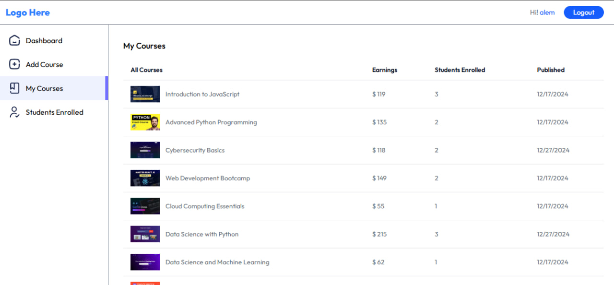

#  Learning Management System (LMS)

> 🚧 This project is currently in active development.

This is a modern Learning Management System (LMS) web application that allows educators to publish courses and students to enroll and study online.

---

## 📸 Preview

### Preview 1: Home page_1
 <!-- Update path if necessary -->

---
### Preview 2: Home page_2
 <!-- Update path if necessary -->

---
### Preview 3: Courses list page
 <!-- Update path if necessary -->

---
### Preview 4: My courses page
 <!-- Update path if necessary -->

---
### Preview 5: Educators dashboard
 <!-- Update path if necessary -->

---
### Preview 6: My Enrollments page
 <!-- Update path if necessary -->

---

##  Features until now

-  Instructor dashboard for viewing 
-  Student portal for browsing and start Learning courses
-  Responsive design (mobile + desktop)
-  Built with React + Vite
-  User context with centralized state management
-  User Authentication with jwt  — Using HTTP-only cookies for session Management.

##  Features to come

-Since the project is using dummy data from the internet, I will be developing the backend specially adding strip payment gateway. 
Through strip payment student can purchase the courses online and educator and earn for their courses.
  
---

##  Tech Stack used until this point

- **Frontend**: React, Tailwind CSS
- **Build Tool**: Vite
- **State Management**: React Context API
- **Version Control**: Git & GitHub
- **Deployment**: vercel for the frontend and render for the backend

---

##  Live Demo

Check out the live site here: [My_project_on Vercel](https://lms-lilac-nine.vercel.app/)

---

##  Installation
Just to view the Frontend + Login, signup and forget password features

```bash
git clone https://github.com/Wondirad-Kifelew/Learning_Management_System.git
cd Learning_Management_System/client
npm install
```

---

## Run Locally

```bash
npm run dev
```

---

## Project Status

>  Frontend is complete 
>  Backend development has started - finished the user authentication.

